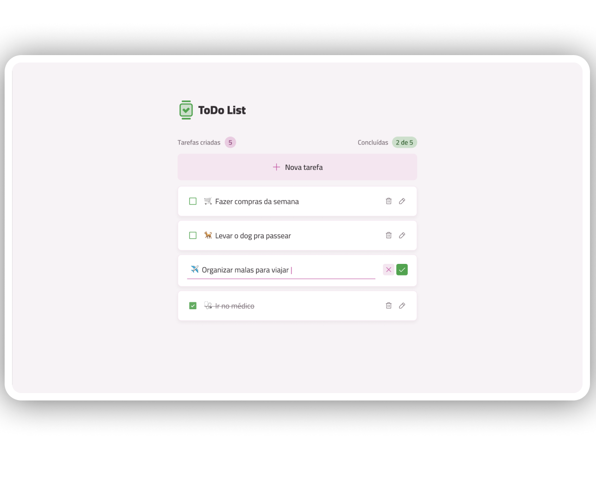

---

# ✅ Todo Project

A clean and minimal **task management app** built with React and TypeScript. Create, complete, and delete tasks with a smooth and responsive interface.

---

## 🚀 Tech Stack

- [React](https://react.dev/)
- [TypeScript](https://www.typescriptlang.org/)
- [Vite](https://vitejs.dev/)
- [Biome](https://biomejs.dev/) — linting & formatting

---

<div align="center">
  
</div>

---

## 📦 Getting Started

### Prerequisites

Make sure you have the following installed:

- [Node.js](https://nodejs.org/) (v18+)
- [pnpm](https://pnpm.io/)

```bash
npm install -g pnpm
```

---

### Installation

**1. Clone the repository**

```bash
git clone https://github.com/your-username/todo-project.git
```

**2. Navigate into the project folder**

```bash
cd todo-project
```

**3. Install dependencies**

```bash
pnpm install
```

---

### Running the app

```bash
pnpm dev
```

The app will be available at `http://localhost:5173`

---

### Build for production

```bash
pnpm build
```

### Preview the production build

```bash
pnpm preview
```

---

## 📁 Project Structure

```
src/
├── assets/
│   └── images/
├── components/
│   ├── core/        # Domain components (Header, Footer, TaskItem...)
│   └── ui/          # Reusable UI primitives (Button, Card, Input...)
├── helpers/         # Utility functions
├── hooks/           # Custom React hooks
├── models/          # TypeScript interfaces and types
└── pages/           # Page-level components and layouts
```

---

## 📝 License

This project is for learning purposes, developed during the [Rocketseat](https://www.rocketseat.com.br/) ReactJS track.
